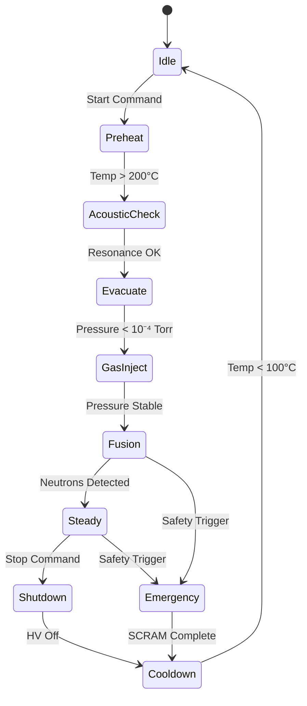
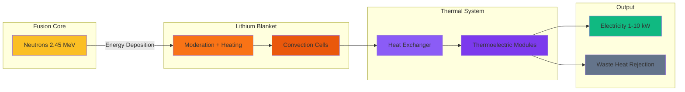
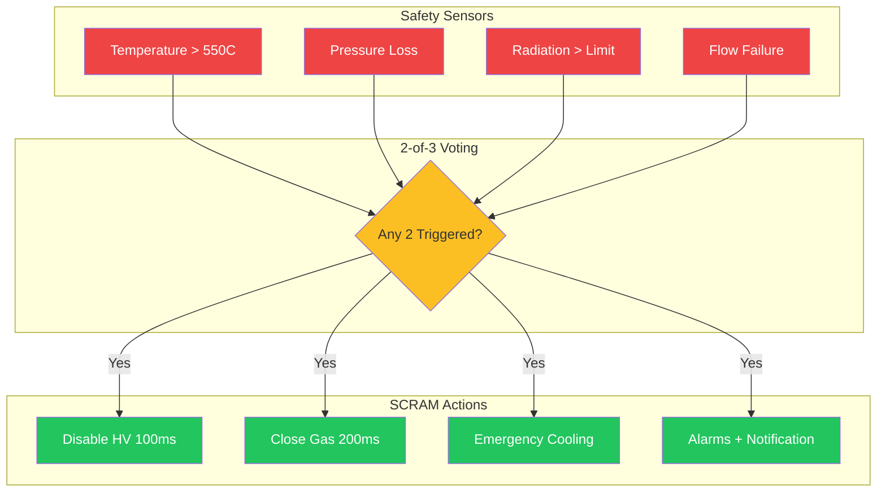

# System Diagrams

Visual representations of the L.A.F.R.E.S. system architecture, components, and data flow.

## System Architecture Overview

This diagram shows the five integrated subsystems and their interconnections:

**Key Components:**
- **AI Control System** - Central brain managing all subsystems
- **Micro-Fusion Core** - Pulsed IEC neutron source
- **Liquid Lithium Blanket** - Neutron moderator and heat sink
- **Acoustic Stabilization** - Phased array for MHD damping
- **Thermal Conversion** - Thermoelectric power recovery
- **Sensor Suite** - 50+ channel monitoring system

---

## Reactor Cross-Section

Detailed cross-sectional view of the reactor vessel showing all layers:

**Layer Structure (outside to inside):**
1. **Outer Steel Vessel** (5-10 mm) - Primary containment
2. **Thermal Insulation** (2-5 cm) - Heat retention
3. **Acoustic Transducers** (32-64 units) - Surface stabilization
4. **Liquid Lithium** (10-20 cm) - 300-500°C operating temperature
5. **Inner Acoustic Boundary** - Lithium containment
6. **Vacuum Gap** (1-5 cm) - Thermal isolation
7. **Fusion Core Chamber** - IEC cathode grid assembly

---

## Control System Data Flow

Information flow from sensors through processing to actuators:

**Processing Layers:**
| Layer | Latency | Function |
|-------|---------|----------|
| FPGA | &lt;1 ms | Acoustic control, safety interlocks |
| RT-Linux | ~10 ms | Thermal regulation, state machine |
| GPU/ML | ~100 ms | Optimization, anomaly detection |

**Data Rates:**
- Sensor input: 1-10 MB/s aggregate
- Safety sampling: 10 kHz
- Acoustic control: 1-10 kHz
- Thermal monitoring: 1-10 Hz

---

## Additional Technical Diagrams

### Mermaid: System State Machine

### Mermaid: Heat Flow Diagram

### Mermaid: Safety Interlock Logic

---

## Download Diagrams

All diagrams are available in SVG format for high-quality printing and presentations:

- [System Architecture Diagram](/img/system-architecture-diagram.svg)
- [Reactor Cross-Section](/img/reactor-cross-section.svg)
- [Data Flow Diagram](/img/data-flow-diagram.svg)

