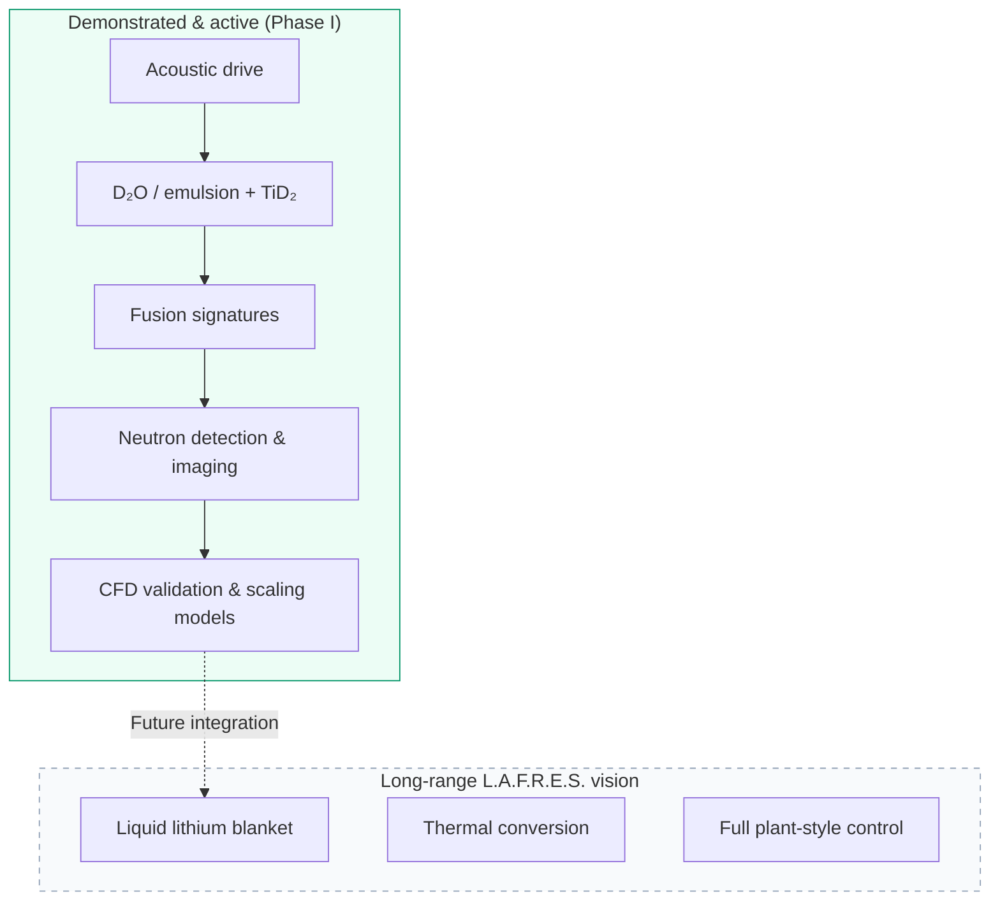
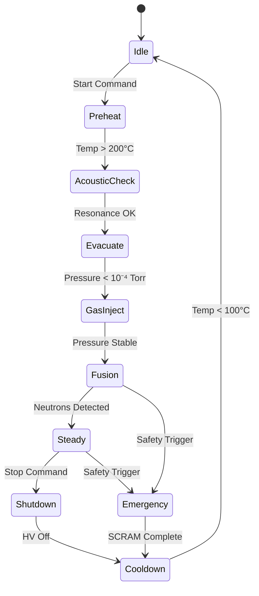
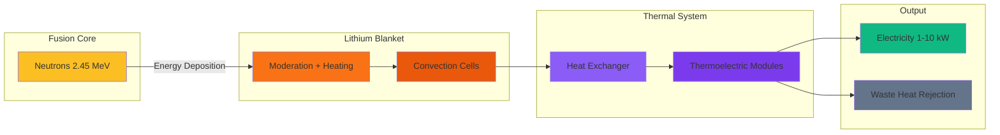
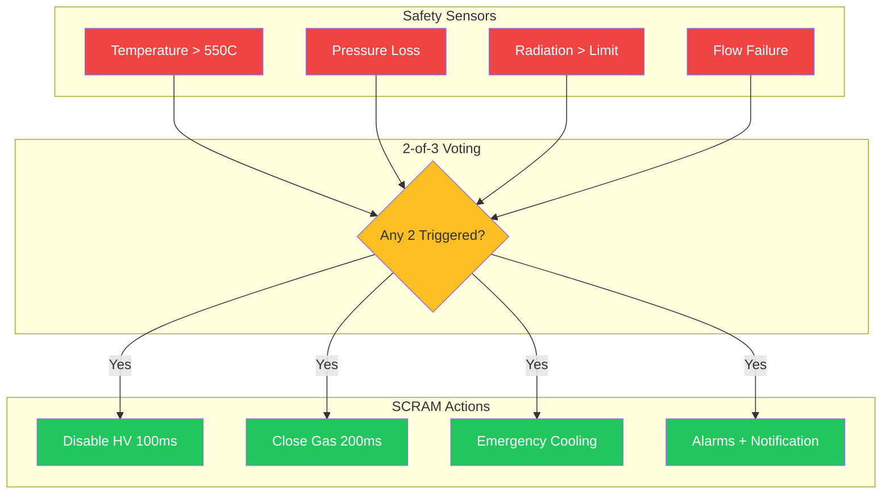

# System Diagrams

Visual representations of the L.A.F.R.E.S. program: **(A)** the **integrated reactor vision** (lithium blanket, full plant-style subsystems), and **(B)** the **acoustic solid-state fusion path** demonstrated in the peer-reviewed baseline (Nature Scientific Reports, 2024).

## Diagram version register

| ID | Asset | Version | Date | Scope |
|----|-------|---------|------|--------|
| **SYS-ARCH** | [system-architecture-diagram.svg](/img/system-architecture-diagram.svg) | **v2.0** | March 2026 | Full L.A.F.R.E.S. integrated architecture (future system) |
| **RX-XSEC** | [reactor-cross-section.svg](/img/reactor-cross-section.svg) | **v2.0** | March 2026 | Conceptual vessel / lithium layers (vision) |
| **DATAFLOW** | [data-flow-diagram.svg](/img/data-flow-diagram.svg) | **v2.0** | March 2026 | Control and safety data flow (vision) |
| **ORG** | [team-org-chart.svg](/img/team-org-chart.svg) (see [Team](/docs/team)) | **v2.0** | March 2026 | Organization chart (summary) |

**Note:** “Vision” diagrams describe the **long-range integrated concept**. The **demonstrated** program today is centered on **acoustic cavitation + TiD₂** solid-state fusion, detection, and modeling—see [Project plan](/docs/project-plan) and [Published results](/docs/research/published-results).

---

## Demonstrated program (conceptual flow)

What the lab executes today is **not** the full five-subsystem plant below—it is the **left branch** of this high-level map:

```mermaid
flowchart TB
  subgraph today["Demonstrated & active (Phase I)"]
    A[Acoustic drive] --> B[D₂O / emulsion + TiD₂]
    B --> C[Fusion signatures]
    C --> D[Neutron detection & imaging]
    D --> E[CFD validation & scaling models]
  end
  subgraph vision["Long-range L.A.F.R.E.S. vision"]
    F[Liquid lithium blanket]
    G[Thermal conversion]
    H[Full plant-style control]
  end
  E -.->|Future integration| F
  style today fill:#ecfdf5,stroke:#059669
  style vision fill:#f8fafc,stroke:#94a3b8,stroke-dasharray: 5 5
```

---

## System Architecture Overview (integrated vision)

This diagram shows the five integrated subsystems and their interconnections for the **full conceptual system**:

**Key Components:**
- **AI Control System** - Central brain managing all subsystems
- **Micro-Fusion Core** - Pulsed IEC neutron source
- **Liquid Lithium Blanket** - Neutron moderator and heat sink
- **Acoustic Stabilization** - Phased array for MHD damping
- **Thermal Conversion** - Thermoelectric power recovery
- **Sensor Suite** - 50+ channel monitoring system

---

## Reactor Cross-Section

Detailed cross-sectional view of the reactor vessel showing all layers:

**Layer Structure (outside to inside):**
1. **Outer Steel Vessel** (5-10 mm) - Primary containment
2. **Thermal Insulation** (2-5 cm) - Heat retention
3. **Acoustic Transducers** (32-64 units) - Surface stabilization
4. **Liquid Lithium** (10-20 cm) - 300-500°C operating temperature
5. **Inner Acoustic Boundary** - Lithium containment
6. **Vacuum Gap** (1-5 cm) - Thermal isolation
7. **Fusion Core Chamber** - IEC cathode grid assembly

---

## Control System Data Flow

Information flow from sensors through processing to actuators:

**Processing Layers:**
| Layer | Latency | Function |
|-------|---------|----------|
| FPGA | &lt;1 ms | Acoustic control, safety interlocks |
| RT-Linux | ~10 ms | Thermal regulation, state machine |
| GPU/ML | ~100 ms | Optimization, anomaly detection |

**Data Rates:**
- Sensor input: 1-10 MB/s aggregate
- Safety sampling: 10 kHz
- Acoustic control: 1-10 kHz
- Thermal monitoring: 1-10 Hz

---

## Additional Technical Diagrams

### Mermaid: System State Machine

```mermaid
stateDiagram-v2
    [*] --> Idle
    Idle --> Preheat: Start Command
    Preheat --> AcousticCheck: Temp > 200°C
    AcousticCheck --> Evacuate: Resonance OK
    Evacuate --> GasInject: Pressure < 10⁻⁴ Torr
    GasInject --> Fusion: Pressure Stable
    Fusion --> Steady: Neutrons Detected
    Steady --> Shutdown: Stop Command
    Shutdown --> Cooldown: HV Off
    Cooldown --> Idle: Temp < 100°C
    
    Fusion --> Emergency: Safety Trigger
    Steady --> Emergency: Safety Trigger
    Emergency --> Cooldown: SCRAM Complete
```

### Mermaid: Heat Flow Diagram

```mermaid
flowchart LR
    subgraph Core["Fusion Core"]
        N["Neutrons 2.45 MeV"]
    end
    
    subgraph Lithium["Lithium Blanket"]
        M["Moderation + Heating"]
        C["Convection Cells"]
    end
    
    subgraph Thermal["Thermal System"]
        HX["Heat Exchanger"]
        TE["Thermoelectric Modules"]
    end
    
    subgraph Output["Output"]
        E["Electricity 1-10 kW"]
        W["Waste Heat Rejection"]
    end
    
    N -->|Energy Deposition| M
    M --> C
    C --> HX
    HX --> TE
    TE --> E
    TE --> W
    
    style N fill:#fbbf24
    style M fill:#f97316
    style C fill:#ea580c
    style HX fill:#8b5cf6
    style TE fill:#7c3aed
    style E fill:#10b981
    style W fill:#64748b
```

### Mermaid: Safety Interlock Logic

```mermaid
flowchart TD
    subgraph Sensors["Safety Sensors"]
        T["Temperature > 550C"]
        P["Pressure Loss"]
        R["Radiation > Limit"]
        F["Flow Failure"]
    end
    
    subgraph Logic["2-of-3 Voting"]
        V{"Any 2 Triggered?"}
    end
    
    subgraph Actions["SCRAM Actions"]
        HV["Disable HV 100ms"]
        GAS["Close Gas 200ms"]
        COOL["Emergency Cooling"]
        ALARM["Alarms + Notification"]
    end
    
    T --> V
    P --> V
    R --> V
    F --> V
    
    V -->|Yes| HV
    V -->|Yes| GAS
    V -->|Yes| COOL
    V -->|Yes| ALARM
    
    style T fill:#ef4444,color:#fff
    style P fill:#ef4444,color:#fff
    style R fill:#ef4444,color:#fff
    style F fill:#ef4444,color:#fff
    style V fill:#fbbf24
    style HV fill:#22c55e,color:#fff
    style GAS fill:#22c55e,color:#fff
    style COOL fill:#22c55e,color:#fff
    style ALARM fill:#22c55e,color:#fff
```

---

## Download diagrams

All diagrams are available in SVG format for high-quality printing and presentations (stamped **v2.0 · March 2026** in the figure):

- [System Architecture Diagram](/img/system-architecture-diagram.svg) — `SYS-ARCH` v2.0  
- [Reactor Cross-Section](/img/reactor-cross-section.svg) — `RX-XSEC` v2.0  
- [Data Flow Diagram](/img/data-flow-diagram.svg) — `DATAFLOW` v2.0  

---

**Page version:** 1.1 · **Last updated:** March 2026

