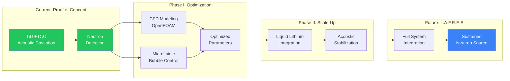

# L.A.F.R.E.S. Project Overview

## Executive Summary

The **Lithium Acoustic Fusion Reactor for Energy Sustainability (L.A.F.R.E.S.)** is a research-grade conceptual design combining multiple advanced technologies to create a controlled neutron source with integrated thermal management. This document provides a high-level overview of the system architecture, objectives, and scope.

:::tip Research Foundation
This project builds upon experimental discoveries at Maximus Energy Corporation demonstrating acoustic cavitation-induced fusion in titanium deuteride systems. See [Key Discoveries](/docs/research/discoveries) for details on the foundational research.
:::

## Experimental Foundation

L.A.F.R.E.S. is grounded in demonstrated experimental results:

- **Acoustic Cavitation Fusion**: Neutron production observed when D₂O bubbles collapse near titanium deuteride particles
- **Sustained Operation**: Neutron emission maintained for hours of continuous operation
- **Extreme Pressures**: Acoustic peaks exceeding 24,000 psi achieved through bubble dynamics
- **Operating Laboratory**: Fully equipped research facility in Naples, FL ([see facilities](/docs/lab/facilities))

### Development Pathway

## Project Scope

### What This Project IS

- **Research Blueprint**: A fully documented conceptual design for academic and engineering analysis
- **Neutron Source**: A controlled, pulsed neutron generator for materials testing
- **Multi-Physics Integration**: Combining plasma physics, fluid dynamics, acoustics, and thermal engineering
- **Safety-First Design**: Comprehensive hazard analysis and mitigation strategies
- **Simulation Framework**: Complete computational models for system validation

### What This Project IS NOT

- ❌ **Not a power generator**: Does not claim net-positive energy output
- ❌ **Not ready for construction**: Requires extensive validation and regulatory approval
- ❌ **Not a commercial product**: Purely for research and development purposes
- ❌ **Not ignoring physics**: Acknowledges all known limitations and challenges

## System Concept

L.A.F.R.E.S. integrates five primary subsystems:

### 1. Micro-Fusion Core
A compact, pulsed plasma device designed to generate controlled bursts of neutrons through deuterium-deuterium (D-D) or deuterium-tritium (D-T) fusion reactions at microscale.

**Key Parameters:**
- Pulse duration: 10-100 μs
- Repetition rate: 1-100 Hz
- Neutron yield: 10⁶–10¹⁰ n/s (laboratory scale)
- Input power: 10-100 kW (pulsed)

### 2. Liquid Lithium Blanket
A molten lithium-7 shell surrounding the core provides:
- Neutron moderation and capture
- Heat absorption and transport
- Tritium breeding (in simulation scenarios)
- Radiation shielding

**Key Parameters:**
- Temperature: 300-500°C
- Volume: 50-200 liters
- Flow rate: 0.1-1 L/s (if circulating)
- Natural convection or electromagnetic pumping

### 3. Acoustic Stabilization Matrix
A phased array of ultrasonic transducers that:
- Stabilizes the lithium free surface
- Damps MHD instabilities
- Reduces thermal shock
- Provides diagnostic information

**Key Parameters:**
- Frequency range: 10 kHz – 500 kHz
- Number of transducers: 20-100
- Power per transducer: 10-1000 W
- Control latency: &lt;1 ms

### 4. Thermal Conversion System
Thermoelectric modules or micro-Stirling engines extract heat from the lithium and convert it to electricity:
- Partial power recovery
- System self-sufficiency (goal)
- Waste heat rejection

**Key Parameters:**
- Hot side: 400-500°C
- Cold side: 100-200°C
- Conversion efficiency: 10-20%
- Power output: 1-10 kW (estimated)

### 5. AI Control and Monitoring
A real-time control system manages all subsystems:
- Sensor fusion from 50+ channels
- Predictive control algorithms
- Anomaly detection
- Autonomous safety responses

## Technical Readiness Level (TRL)

| Subsystem | Current TRL | Target TRL |
|-----------|-------------|------------|
| Micro-fusion core | 2-3 | 4-5 |
| Lithium handling | 4-5 | 6-7 |
| Acoustic control | 3-4 | 5-6 |
| Thermal conversion | 5-6 | 7-8 |
| AI control | 4-5 | 6-7 |
| **Overall System** | **2** | **4-5** |

## Project Deliverables

### Documentation
- Technical specifications for all subsystems
- Safety analysis and protocols
- Regulatory compliance roadmap
- Literature review and citations

### Simulations
- Neutron transport modeling
- CFD of lithium flow and heat transfer
- Acoustic field finite element analysis
- Thermal-electric system modeling
- Multi-physics coupling

### Design Artifacts
- CAD models (conceptual)
- P&ID diagrams
- Electrical schematics
- Control system architecture

### Experimental Roadmap
- **Phase 0**: Pure simulation
- **Phase 1**: Lithium bench testing (no plasma)
- **Phase 2**: External neutron source testing
- **Phase 3**: Pulsed micro-fusion demonstration

## Risk Assessment

### Technical Risks
- **Neutron yield uncertainty**: Achieving predicted neutron flux
- **Lithium corrosion**: Material compatibility over extended operation
- **Acoustic coupling**: Effective stabilization of liquid metal surface
- **Thermal management**: Reliable heat extraction at scale
- **Control complexity**: Real-time management of coupled physics

### Safety Risks
- **Lithium fire**: Highly reactive with water and air
- **Radiation exposure**: Neutron and gamma radiation
- **Tritium handling**: Radioactive isotope (if used)
- **High temperature**: Thermal hazards
- **System failure modes**: Loss of cooling, containment breach

### Regulatory Risks
- Nuclear regulatory approval requirements
- Radiation licensing
- Environmental impact assessment
- Facility requirements

## Success Criteria

### Phase 0 (Simulation)
- ✓ Validated neutron transport model
- ✓ Converged CFD solution for lithium flow
- ✓ Acoustic field modal analysis complete
- ✓ Integrated thermal-electric model

### Phase 1 (Bench Testing)
- ✓ Stable liquid lithium operation at 400°C
- ✓ Demonstrated acoustic surface control
- ✓ 10% thermoelectric conversion efficiency
- ✓ 100+ hours of safe operation

### Phase 2 (Neutron Coupling)
- ✓ Measured neutron thermalization in lithium
- ✓ Validated instrumentation accuracy
- ✓ Demonstrated tritium breeding (calculation vs. measurement)

### Phase 3 (Micro-Fusion)
- ✓ Detectable neutron production from fusion
- ✓ Integrated system operation
- ✓ Complete safety system validation

## Timeline Estimate

| Phase | Duration | Cumulative |
|-------|----------|------------|
| Phase 0: Simulation | 6-12 months | 12 months |
| Phase 1: Lithium Bench | 12-18 months | 30 months |
| Phase 2: Neutron Coupling | 12-18 months | 48 months |
| Phase 3: Micro-Fusion | 18-24 months | 72 months |

**Total estimated time**: 5-6 years from concept to proof-of-concept demonstration

## Resource Requirements

### Personnel
- Nuclear engineer (1-2)
- Mechanical engineer (1-2)
- Electrical/control engineer (1)
- Physicist (plasma/nuclear) (1)
- Safety specialist (1)
- Technicians (2-3)

### Facilities
- Licensed nuclear research facility
- High-bay laboratory space (&gt;500 m²)
- Radiation monitoring and shielding
- Lithium handling infrastructure
- High-power electrical supply

### Budget Estimate
- Phase 0: $200K - $500K
- Phase 1: $1M - $2M
- Phase 2: $2M - $3M
- Phase 3: $3M - $5M
- **Total**: $6M - $10M

## Next Steps

1. Review detailed technical documentation
2. Examine component specifications
3. Study safety protocols
4. Begin Phase 0 simulation planning

---

**Document Version**: 1.0  
**Last Updated**: December 2025  
**Author**: L.A.F.R.E.S. Team

