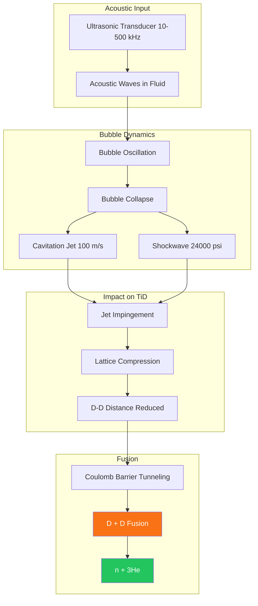

# Acoustic Studies in Liquid Metals

## 1. Introduction

Application of acoustic fields to liquid metals is relatively unexplored, especially at high temperatures relevant to fusion blankets. However, Maximus Energy Corporation has demonstrated that acoustic cavitation can induce nuclear fusion in deuterium-loaded systems.

:::tip Experimental Results
Our laboratory has achieved sustained neutron production through acoustic cavitation in TiD/D₂O systems. See [Key Discoveries](/docs/research/discoveries) for details.
:::

## 1.1 Acoustic Cavitation Fusion Mechanism

## 2. Relevant Literature

### 2.1 Ultrasonic Cavitation in Liquid Metals
- **Eskin & Eskin (2015)**: *Ultrasonic Treatment of Light Alloy Melts*
- **Application**: Grain refinement, degassing in aluminum casting
- **Frequency**: 15-25 kHz (lower than L.A.F.R.E.S.)
- **Finding**: Cavitation threshold in liquid aluminum ~1-2 MPa

### 2.2 Acoustic Levitation
- **Foresti et al. (2013)**: "Acoustic levitation of soap bubbles in air"
- **Xie & Wei (2001)**: "Parametric study of acoustic levitation"
- **Relevance**: Radiation pressure can levitate objects; applicable to surface control

### 2.3 Liquid Metal MHD-Acoustic Coupling
- **Literature Gap**: Very few studies on acoustic waves in electrically conducting fluids with magnetic fields
- **Theory**: Alfvén waves (magnetoacoustic) may couple to ultrasonic modes

## 3. Expected Phenomena in L.A.F.R.E.S.

### 3.1 Radiation Pressure
- Formula: P_rad = E_acoustic / c_sound
- For 1 MPa amplitude: P_rad ~ 0.05 MPa (5% of acoustic pressure)
- **Effect**: Can counteract gravity or disturbances on lithium surface

### 3.2 Acoustic Streaming
- Nonlinear effect: Steady flow induced by acoustic absorption
- Velocity scale: v ~ (α λ) v_acoustic²
- For lithium: Low absorption α → weak streaming (but still measurable)

### 3.3 Temperature Effects
- Sound speed in lithium: c(T) ≈ 4600 - 0.5×T (m/s, T in °C, rough approximation)
- At 400°C: c ~ 4400 m/s
- Implications: Acoustic resonances shift with temperature (must account for in control)

## 4. Experimental Validation (Planned)

### Phase 1 Tests
1. **Frequency sweep**: Identify cavity modes, compare to FE simulation
2. **Surface displacement**: Measure with capacitive sensors, correlate with acoustic pressure
3. **Impulse response**: Apply mechanical disturbance, measure decay rate with/without acoustic control

### Expected Results
- Mode frequencies within ±5% of simulation
- Surface damping &gt;60% (compared to passive)

## 5. Novel Contributions

L.A.F.R.E.S. will be first system to:
- Integrate high-power ultrasonic array (kW-scale) with liquid lithium at 400°C
- Demonstrate active acoustic stabilization in fusion-relevant environment
- Publish data on acoustic properties of liquid lithium at temperature

---

**Prepared by**: L.A.F.R.E.S. Acoustics Research Team

