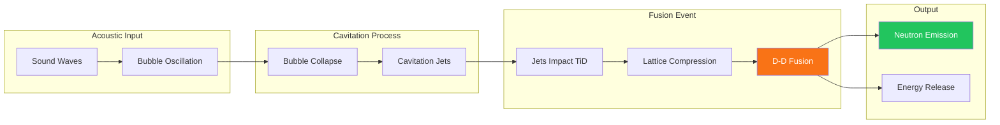
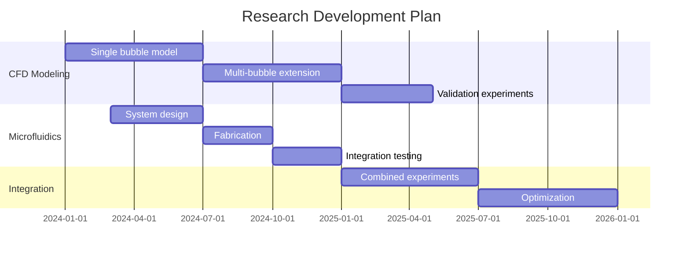

# Research Discoveries & Background

## Overview

Maximus Energy Corporation has discovered a novel approach to nuclear fusion that is remarkably simple compared to traditional plasma-based methods. This page documents the key findings that form the foundation of the L.A.F.R.E.S. project.

---

## The Discovery: Acoustic Cavitation Fusion

### Core Mechanism

The method involves:

1. **Titanium Deuteride Particles (TiD)** - Solid particles suspended in mineral oil
2. **Heavy Water Bubbles (D₂O)** - Microbubbles/droplets dispersed in the suspension
3. **Acoustic Excitation** - Periodic sound waves applied to the suspension

**Result:** Nuclear fusion identified by significant neutron flux coinciding with acoustic wave application.

### Proposed Fusion Mechanism

**Hypothesis:** Nuclear fusion occurs when cavitation jets from collapsing D₂O bubbles impinge upon suspended TiD particles, forcing deuterium dissolved in the titanium lattice to fuse.

---

## Key Experimental Findings

### Sustained Neutron Production

- **Duration:** Neutron production sustained for **hours** of continuous operation
- **Correlation:** Neutron emission coincides with acoustic wave application
- **Reproducibility:** Results achieved across multiple experimental runs

### Extreme Acoustic Pressures

A critical discovery involves secondary acoustic waves:

| Parameter | Value |
|-----------|-------|
| Peak Acoustic Pressure | **&gt;24,000 psi** (165+ MPa) |
| Origin | Rebounding bubble expansion |
| Mechanism | Constructive interference of multiple bubble shockwaves |

**Observation:** Neutron emission appears to coincide with the presence of these massive acoustic peaks.

### Bubble Dynamics Complexity

The following factors create complex, interrelated behavior:

- TiD particle size and concentration
- D₂O bubble size and concentration  
- Acoustic drive frequency
- Acoustic drive amplitude
- Multi-bubble interactions

---

## Current Challenges

### 1. Parameter Optimization

It has proven difficult to create conditions necessary for producing the extreme acoustic peaks reliably. The challenges include:

- **Complex multi-bubble interactions** - Bubbles of different sizes interact chaotically
- **Size-dependent dynamics** - Rebounding waves strongly depend on bubble size
- **Broad size distributions** - Current methods produce unpredictable bubble populations

### 2. Reproducibility

Current bubble generation methods produce **broad-peaked size distributions**, leading to:
- Unpredictable behavior
- Chaotic bubble interactions
- Difficulty in replicating consistent results
- Challenges in systematic study

---

## Proposed Research Approach

### Objective 1: CFD Modeling

**Goal:** Develop computational fluid dynamics model in OpenFOAM for single bubble collapse

**Purpose:**
- Predict magnitude and frequency of rebounding bubble shockwaves
- Model dependency on acoustic drive parameters (frequency, amplitude)
- Determine optimal bubble size for achieving 24,000+ psi acoustic peaks
- Guide experimental parameter selection

**Deliverables:**
- Validated CFD model of bubble collapse in reactor conditions
- Parameter maps relating bubble size → acoustic peaks
- Optimal operating conditions for fusion

### Objective 2: Microfluidic Bubble Generation

**Goal:** Develop microfluidic system for precisely controlled D₂O microbubble generation

**Requirements:**
- Specified bubble size (target diameter TBD from CFD results)
- Narrow size distribution (low polydispersity)
- Controlled concentration
- Reproducible generation

**Benefits:**
- Predictable bubble behavior
- Consistent experimental conditions
- Systematic parameter studies
- Reproducible fusion events

---

## Scientific Significance

### Intellectual Merit

By generating microbubbles of specified size combined with validated bubble collapse modeling, this research will advance understanding of:

- Nuclear fusion reactions in titanium lattice
- Solid-state fusion under mechanical impact
- Cavitation-induced nuclear processes
- Acoustic energy concentration mechanisms

### Comparison to Traditional Fusion

| Aspect | Traditional Plasma Fusion | Acoustic Cavitation Fusion |
|--------|--------------------------|---------------------------|
| Temperature | 100+ million °C | Near ambient |
| Containment | Magnetic/inertial | None required |
| Complexity | Extremely high | Remarkably simple |
| Scale | Stadium-sized facilities | Tabletop apparatus |
| Moving parts | Many (pumps, magnets) | Minimal |

---

## Broader Impacts

Mastery of solid-state nuclear fusion reactions could enable:

### 1. Power Generation
- Low-cost fusion reactors
- No plasma containment required
- Simplified engineering
- Reduced hazards

### 2. Neutron Sources
- Compact neutron generators
- Non-destructive testing
- Neutron imaging / radiography
- Materials analysis

### 3. Medical Applications
- Medical isotope synthesis
- Nuclear pharmacology
- Radiopharmaceutical production
- Cancer treatment isotopes

### 4. Industrial Applications
- Neutron activation analysis
- Security screening
- Materials research
- Semiconductor doping

---

## Research Timeline

---

## Publications & References

*[To be added as research is published]*

---

## Contact

For research collaboration inquiries:
- **Email:** research@lafres.org
- **Laboratory:** Maximus Energy Corporation, Naples, FL

