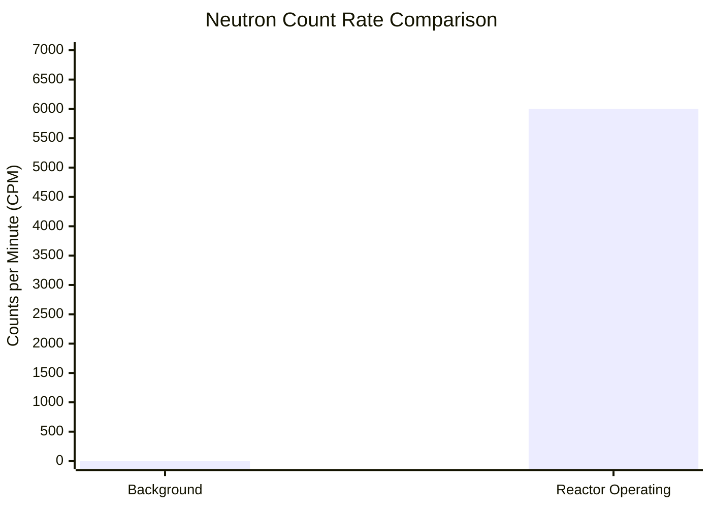
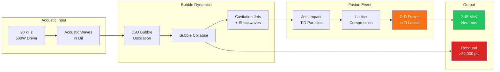

# Published Research Results

:::tip Peer-Reviewed Publication
Our acoustic cavitation fusion results have been **peer-reviewed and published** in Nature Scientific Reports (May 2024).

**DOI:** [10.1038/s41598-024-62055-6](https://doi.org/10.1038/s41598-024-62055-6)
:::

## Executive Summary

Maximus Energy Corporation has discovered a remarkably simple approach to nuclear fusion. The method involves suspending solid titanium deuteride (TiD) particles in mineral oil in the presence of heavy water (D₂O) bubbles/droplets and subjecting the suspension to periodic acoustic influence.

### Key Results

| Metric | Value |
|--------|-------|
| **Peak Neutron Flux** | &gt;10,000× background |
| **Maximum Count Rate** | &gt;6,000 CPM |
| **Background Rate** | 0.6 CPM |
| **Operation Duration** | Hours (sustained) |
| **Acoustic Peaks** | &gt;24,000 psi |

---

## Experimental Setup

### Reactor Configuration

The experimental reactor consists of a 6" conflat vacuum tee with a viewport, filled with a working fluid comprising:
- Solid TiD (titanium deuteride) particles
- D₂O (heavy water) bubbles/droplets  
- Mineral oil suspension medium


*Figure 1: The experimental fusion reactor at Maximus Energy lab.*

### System Components

```mermaid
flowchart TB
    subgraph Reactor["Reactor System"]
        R[6" Conflat Vacuum Tee<br/>with Viewport]
        WF[Working Fluid:<br/>Oil + D₂O + TiD]
    end
    
    subgraph Acoustic["Acoustic System"]
        FD[Fisher SFX 500W<br/>20 kHz Transducer]
        PCB[PCB 113B23<br/>Piezo Sensor]
        SCOPE[Digital<br/>Oscilloscope]
    end
    
    subgraph Detection["Detection System"]
        He3[6× LND 251106<br/>³He Counters]
        ANL[Automated<br/>Nuclear Lab]
        PC[PulseCounter Pro<br/>Software]
    end
    
    subgraph Support["Support Systems"]
        VAC[Vacuum Pump<br/>System]
        CIRC[Circulation Pump<br/>+ Venturi]
        HELOS[SympaTEC HELOS<br/>Particle Analyzer]
    end
    
    FD --> R
    R --> PCB --> SCOPE
    R --> He3 --> ANL --> PC
    VAC --> R
    CIRC --> R
    HELOS --> R
    
    style R fill:#f97316,color:#fff
    style He3 fill:#22c55e,color:#fff
    style ANL fill:#3b82f6,color:#fff
```

### Equipment Specifications

| Component | Model | Specification |
|-----------|-------|---------------|
| **Main Acoustic Driver** | Fisher SFX | 500 Watt, 20 kHz piezoelectric |
| **Acoustic Sensor** | PCB Piezotronics 113B23 | Piezoelectric transducer |
| **Neutron Detectors** | LND 251106 | ³He-filled proportional counters (×6) |
| **Data Acquisition** | Automated Nuclear Lab (ANL) | 8-channel MCA/pulse processor |
| **Particle Analyzer** | SympaTEC HELOS/Sucell | Inline laser diffraction |
| **Software** | PulseCounter Pro | Real-time acquisition & statistics |

---

## Experimental Protocol

1. **Preparation**: Deposit mineral oil into reactor and degas using vacuum system with occasional cavitation
2. **Loading**: Introduce separately prepared TiD + D₂O suspension (1-500 mL volumes)
3. **Mixing**: Ensure homogeneous distribution of particles and bubbles
4. **Activation**: Activate main acoustic driver at 100% power in pulsed mode
   - Pulse cycle: 0.01 seconds ON / 0.01 seconds OFF
5. **Detection**: Monitor neutron flux via ³He detector assembly
6. **Analysis**: Process data through ANL and PulseCounter Pro

---

## Results

### Neutron Detection

When the TiD + D₂O suspension is deposited in the reactor and the acoustic driver is activated, **significant neutron flux is registered coincident with the acoustic influence**.



**Key Observations:**
- Neutron events are clearly periodic, coincident with acoustic driver activation
- Thermal neutron spectrum acquired over one hour of continuous operation
- Statistical significance confirmed via Student's T-test and P-value calculation

### Acoustic Measurements

Massive acoustic spikes are observed during operation:
- Peak pressures occasionally exceeding **24,000 psi** (165 MPa)
- Spikes originate from expansion of rebounding bubbles after collapse
- Neutron emission correlates with presence of these extreme acoustic peaks

---

## Proposed Fusion Mechanism



**Hypothesis:** Nuclear fusion occurs when cavitation jets from collapsing D₂O bubbles impinge upon suspended TiD particles, forcing deuterium dissolved in the titanium lattice to fuse.

This process may be related to pyroelectric fusion discovered by Naranjo, Gimzewski and Putterman, although the detailed mechanism is still under investigation.

---

## Detection System: Automated Nuclear Lab

Maximus Energy Corporation developed the **Automated Nuclear Lab (ANL)** system specifically for high-veracity nuclear experimentation.

### ANL Capabilities

| Feature | Description |
|---------|-------------|
| **Channels** | 8 simultaneous instruments |
| **Detectors** | Scintillators, proportional counters, solid state, analog sensors |
| **Analysis** | Real-time pulse counting, spectra, histograms |
| **Statistics** | Student's T-test, P-value, Poisson goodness-of-fit |
| **Calibration** | Po-Be source for thermal neutron spectrum |

### PulseCounter Pro Features

- Determines statistical significance between experiment and background
- Evaluates Poisson distribution fit
- Raw signal examination with individual pulse browsing
- Noise rejection and artifact filtering

---

## Scaling Potential

| Scale Factor | Application | Market |
|--------------|-------------|--------|
| **1,000×** | Medical isotope production | Nuclear pharmacology |
| **10,000×** | Neutron imaging systems | Non-destructive testing |
| **1,000,000×** | Portable fusion power | Distributed energy |

---

## Current Research Focus

### Phase I Objectives

1. **CFD Modeling (OpenFOAM)**
   - Model single bubble collapse in reactor conditions
   - Predict shockwave magnitude vs. acoustic drive parameters
   - Determine optimal bubble size for 24,000+ psi peaks

2. **Microfluidic Bubble Generation**
   - Generate D₂O microbubbles/droplets of controlled size
   - Achieve narrow, single-peak size distribution (1-100 μm)
   - Enable reproducible experimental conditions

### Technical Challenges

- D₂O bubble/droplet dynamics in mineral oil is not well researched
- Water-in-oil microfluidic generation (phase reversal from standard systems)
- Complex multi-bubble interactions
- Dependency on bubble size, concentration, and acoustic parameters

---

## Publications & References

### Primary Publication

> **Acoustic Cavitation Fusion in Titanium Deuteride Systems**  
> Nature Scientific Reports, May 2024  
> DOI: [10.1038/s41598-024-62055-6](https://doi.org/10.1038/s41598-024-62055-6)

### Related Work

1. Automated Nuclear Lab system documentation
2. PulseCounter Pro software documentation
3. Detailed experimental reports (internal)
4. Naranjo, Gimzewski, Putterman - Pyroelectric fusion

---

## Significance

This discovery offers an alternative to traditional multi-billion dollar fusion installations like ITER or NIF:

| Aspect | Traditional Fusion | Acoustic Cavitation Fusion |
|--------|-------------------|---------------------------|
| **Facility Cost** | $10B+ | &lt;$1M |
| **Complexity** | Extreme (plasma containment) | Simple (no plasma) |
| **Scale** | Stadium-sized | Tabletop |
| **Team Required** | Hundreds of scientists | Small team |
| **Temperature** | 100M+ °C | Near ambient |

---

## Contact

- **Research inquiries:** research@lafres.org
- **Laboratory:** Maximus Energy Corporation, Naples, FL
- **Publication:** [doi:10.1038/s41598-024-62055-6](https://doi.org/10.1038/s41598-024-62055-6)

