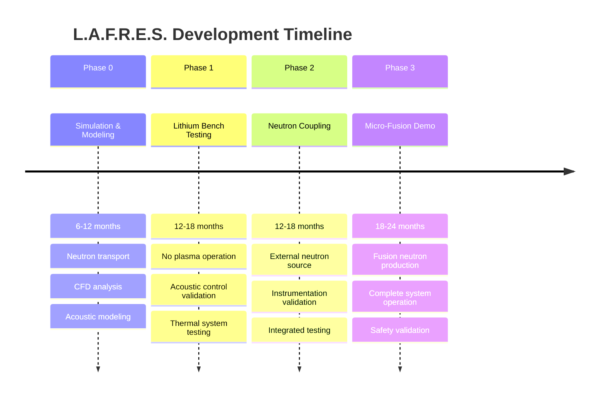
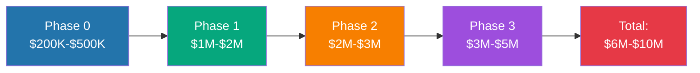

# Development Roadmap

## Introduction

The L.A.F.R.E.S. development plan is structured in **four phases** spanning approximately **5-6 years**, from pure simulation through proof-of-concept demonstration.

## Phase Overview

## Phase Summaries

### Phase 0: Simulation & Modeling
**Duration**: 6-12 months  
**Budget**: $200K - $500K

Pure computational work to validate physics models and design parameters.

**[View Details →](phase-0-simulation)**

### Phase 1: Lithium Bench Testing
**Duration**: 12-18 months  
**Budget**: $1M - $2M

Build and test lithium handling and acoustic systems without neutron production.

**[View Details →](phase-1-prototype)**

### Phase 2: Neutron Coupling
**Duration**: 12-18 months  
**Budget**: $2M - $3M

Integrate external neutron source to test neutron-lithium interactions.

**[View Details →](phase-2-validation)**

### Phase 3: Micro-Fusion Demonstration
**Duration**: 18-24 months  
**Budget**: $3M - $5M

Complete integrated system with fusion neutron production.

**[View Details →](phase-3)**

## Cumulative Investment

## Key Milestones

| Milestone | Target Date | Phase |
|-----------|-------------|-------|
| Neutron transport model validated | Month 6 | Phase 0 |
| CFD converged solution | Month 9 | Phase 0 |
| Lithium system operational | Month 18 | Phase 1 |
| Acoustic control demonstrated | Month 24 | Phase 1 |
| External neutron testing complete | Month 36 | Phase 2 |
| First fusion neutrons detected | Month 48 | Phase 3 |
| **System validation complete** | **Month 60-72** | **Phase 3** |

## Critical Path

The project's critical path includes:

1. **Facility licensing** (12-18 months lead time)
2. **Lithium handling infrastructure** (6-9 months)
3. **Fusion core procurement/fabrication** (12-18 months)
4. **Instrumentation integration** (6-12 months)

**Recommendation**: Begin licensing and facility preparation during Phase 0.

## Risk Factors

### Technical Risks
- Acoustic coupling effectiveness
- Fusion yield achievement
- Material compatibility

### Programmatic Risks
- Funding continuity
- Regulatory approval delays
- Personnel recruitment/retention

### Mitigation Strategies
- Incremental validation approach
- Early engagement with regulators
- Academic partnerships for staffing

## Success Criteria by Phase

Each phase has defined **go/no-go** decision points:

- **Phase 0**: Simulation results within 20% of analytical predictions
- **Phase 1**: 100+ hours stable lithium operation
- **Phase 2**: Measured vs. calculated neutron flux agreement within 30%
- **Phase 3**: Detectable fusion neutron production (>10⁶ n/s)

## Next Steps

1. **Review detailed cost estimates** → [View Cost Estimates](cost-estimates)
2. **Study Phase 0 plan** → [Phase 0 Details](phase-0-simulation)
3. **Assess resource requirements** → [Overview](../overview)

---

**Total Timeline**: 5-6 years from concept to proof-of-concept  
**Total Budget**: $6M - $10M

