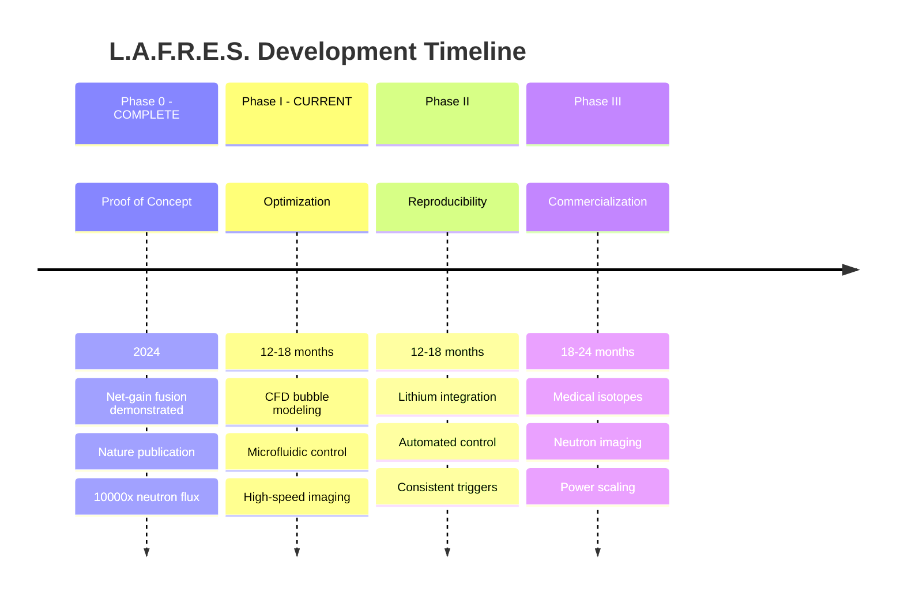
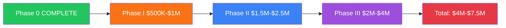

# Development Roadmap

:::success Proof of Concept Complete
**Phase 0 achieved:** Net-gain fusion demonstrated and published in Nature Scientific Reports (2024).  
We are now seeking funding for **Phase I: Optimization**.
:::

## Introduction

L.A.F.R.E.S. has successfully demonstrated acoustic cavitation fusion with **10,000x neutron flux above background**. The development roadmap now focuses on optimization, reproducibility, and scale-up toward commercial applications.

## Phase Overview

## Phase Summaries

### Phase 0: Proof of Concept - COMPLETE
**Status**: ✅ **ACHIEVED**  
**Publication**: Nature Scientific Reports, May 2024

**Key Results:**
- Neutron flux >10,000x background
- Sustained operation for hours
- Acoustic peaks >24,000 psi
- Peer-reviewed publication

### Phase I: Optimization (Current Focus)
**Duration**: 12-18 months  
**Budget**: $500K - $1M

CFD modeling and microfluidic systems for controlled, reproducible fusion conditions.

**Objectives:**
- OpenFOAM bubble collapse modeling
- Microfluidic D₂O bubble generation (1-100 μm)
- High-speed imaging (1M fps) validation
- Determine optimal parameters for fusion

**[View Details →](phase-1-prototype)**

### Phase II: Reproducibility & Integration
**Duration**: 12-18 months  
**Budget**: $1.5M - $2.5M

Achieve consistent fusion triggers and integrate lithium blanket system.

**[View Details →](phase-2-validation)**

### Phase III: Commercial Scale-Up
**Duration**: 18-24 months  
**Budget**: $2M - $4M

Scale technology for commercial applications.

| Application | Scale Factor | Market |
|-------------|--------------|--------|
| Medical isotopes | 1,000x | Nuclear pharmacology |
| Neutron imaging | 10,000x | Industrial NDT |
| Portable power | 1,000,000x | Distributed energy |

**[View Details →](phase-3)**

## Investment Required

## Key Milestones

| Milestone | Status | Phase |
|-----------|--------|-------|
| ✅ Net-gain fusion demonstrated | **COMPLETE** | Phase 0 |
| ✅ Peer-reviewed publication | **May 2024** | Phase 0 |
| ✅ 10,000x neutron flux achieved | **COMPLETE** | Phase 0 |
| ⏳ CFD bubble collapse model | In Progress | Phase I |
| ⏳ Microfluidic system operational | Planned | Phase I |
| ⏳ Reproducible fusion triggers | Planned | Phase II |
| ⏳ Lithium blanket integration | Planned | Phase II |
| ⏳ Commercial prototype | Future | Phase III |

## Critical Path

The project's critical path includes:

1. **Facility licensing** (12-18 months lead time)
2. **Lithium handling infrastructure** (6-9 months)
3. **Fusion core procurement/fabrication** (12-18 months)
4. **Instrumentation integration** (6-12 months)

**Recommendation**: Begin licensing and facility preparation during Phase 0.

## Risk Factors

### Technical Risks
- Acoustic coupling effectiveness
- Fusion yield achievement
- Material compatibility

### Programmatic Risks
- Funding continuity
- Regulatory approval delays
- Personnel recruitment/retention

### Mitigation Strategies
- Incremental validation approach
- Early engagement with regulators
- Academic partnerships for staffing

## Success Criteria by Phase

| Phase | Criteria | Status |
|-------|----------|--------|
| **Phase 0** | Detectable fusion neutron production | ✅ **EXCEEDED** (10,000x) |
| **Phase I** | CFD model validated against high-speed imaging | ⏳ In Progress |
| **Phase II** | Reproducible fusion on demand | Planned |
| **Phase III** | Commercial-scale neutron output | Future |

## Investment Opportunity

We are currently seeking **$500K - $1M** for Phase I:

| Use of Funds | Amount |
|--------------|--------|
| CFD modeling (OpenFOAM) | $150K |
| Microfluidic system | $200K |
| High-speed camera (Phantom) | $150K |
| Personnel (12-18 mo) | $200K |
| Facilities & supplies | $100K |

**Contact**: investors@lafres.org

## Next Steps

1. **Review our published results** → [Nature Publication](../research/published-results)
2. **See our laboratory** → [Facilities](../lab/facilities)
3. **Meet the team** → [Team & Expertise](../team)
4. **Review cost details** → [Cost Estimates](cost-estimates)

---

**Proof of Concept**: ✅ Complete (Published 2024)  
**Current Focus**: Phase I Optimization  
**Funding Sought**: $500K - $1M

