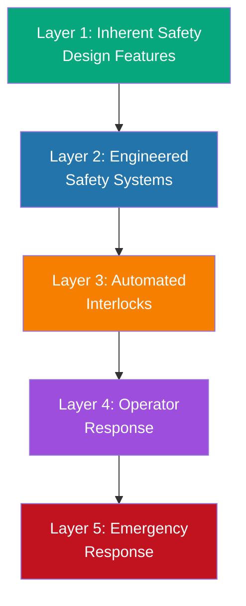

# Safety Overview

## Introduction

Safety is the **highest priority** in the L.A.F.R.E.S. project. This section provides comprehensive safety protocols, hazard analyses, and emergency procedures for all aspects of the system.

## Primary Hazard Categories

### 1. Lithium Safety
- Chemical reactivity with water and air
- Fire and explosion risks
- Handling and containment protocols
- **[Read more →](lithium-safety)**

### 2. Radiation Protection
- Neutron radiation exposure
- Gamma radiation from activated materials
- Dose monitoring and shielding
- **[Read more →](radiation-protocols)**

### 3. Emergency Procedures
- Automated shutdown systems
- Emergency response protocols
- Evacuation procedures
- **[Read more →](emergency-procedures)**

### 4. Tritium Handling (if applicable)
- Radioactive gas containment
- Monitoring and accountability
- Personnel protection
- **[Read more →](tritium-handling)** (for D-T operation scenarios)

## Safety Philosophy

L.A.F.R.E.S. employs a **defense-in-depth** approach:

1. **Prevention**: Design features that minimize hazard probability
2. **Mitigation**: Engineered safety systems to limit consequences
3. **Emergency Response**: Trained personnel and procedures
4. **Regulatory Compliance**: Adherence to NRC, DOE, and OSHA requirements

## Safety System Hierarchy

## Training Requirements

All personnel must complete:
- **General safety orientation**
- **Radiation safety certification**
- **Lithium handling training**
- **Emergency response drills** (quarterly)

## Regulatory Framework

L.A.F.R.E.S. operations require:
- Nuclear Regulatory Commission (NRC) licensing for neutron source
- DOE approval for research activities
- State and local permits for radioactive materials
- OSHA compliance for workplace safety

## Emergency Contacts

**In case of emergency:**
1. **Activate emergency shutdown** (SCRAM button)
2. **Evacuate to safe zone**
3. **Contact Radiation Safety Officer**
4. **Call emergency services** (if needed)

---

**Safety is everyone's responsibility.**

