# System Architecture

## 1. High-Level Architecture

L.A.F.R.E.S. is organized as a multi-layered system integrating five primary subsystems with a centralized AI control system.

### 1.1 System Block Diagram

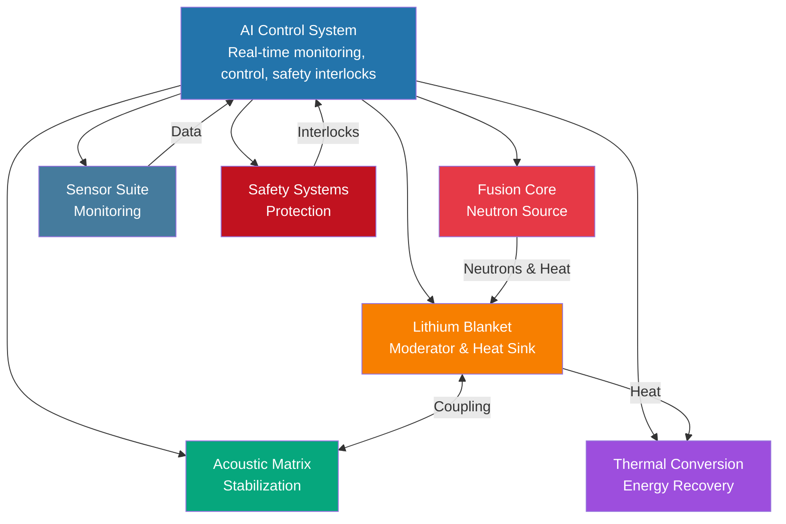

### 1.2 Subsystem Hierarchy

**Level 1: Core Physics**
- Micro-fusion core (neutron source)
- Liquid lithium blanket (moderator, heat sink)

**Level 2: Active Control**
- Acoustic field matrix (stabilization)
- Thermal conversion system (energy recovery)

**Level 3: Monitoring & Safety**
- Sensor suite (distributed measurements)
- AI control system (real-time optimization)
- Safety interlocks (autonomous protection)

## 2. Micro-Fusion Core Architecture

### 2.1 Conceptual Design Options

Three candidate approaches:

**Option A: Inertial Electrostatic Confinement (IEC)**
- Spherical cathode grid
- Radial electric field acceleration
- Ion convergence at center
- Pulsed operation: 10-100 Hz

**Option B: Dense Plasma Focus (DPF)**
- Coaxial electrode geometry  
- Z-pinch compression
- Brief neutron bursts
- Capacitor bank discharge

**Option C: Fusor-Hybrid (Micro-Cusp)**
- Multiple magnetic cusps
- Electrostatic acceleration
- Distributed reaction zones
- Continuous or pulsed

### 2.2 Selected Baseline: Pulsed IEC

**Rationale:**
- Simpler geometry
- Lower peak power requirements
- Better control granularity
- Established neutron yield models

**Key Components:**
- Vacuum chamber: 30-50 cm diameter
- Cathode grid: 5-10 cm diameter, tungsten or molybdenum
- Anode: Chamber wall
- High voltage supply: 30-100 kV
- Deuterium/tritium gas injection system
- Pulse modulator: 10-100 μs duration

### 2.3 Neutron Production Mechanism

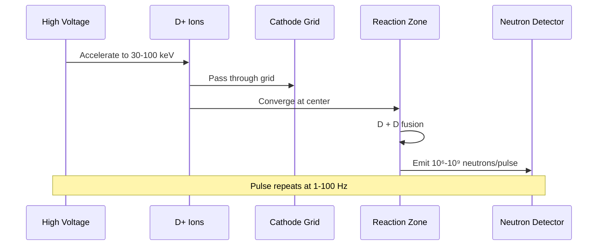

**Average neutron rate**: 10⁶ - 10¹⁰ n/s

### 2.4 Electrical Requirements

- Peak power: 10-100 kW (pulsed)
- Average power: 1-10 kW
- Voltage: 30-100 kV DC
- Current: 100 mA - 1 A (during pulse)
- Capacitor bank: 1-10 J per pulse

## 3. Liquid Lithium Blanket Architecture

### 3.1 Geometry

**Configuration**: Concentric shells

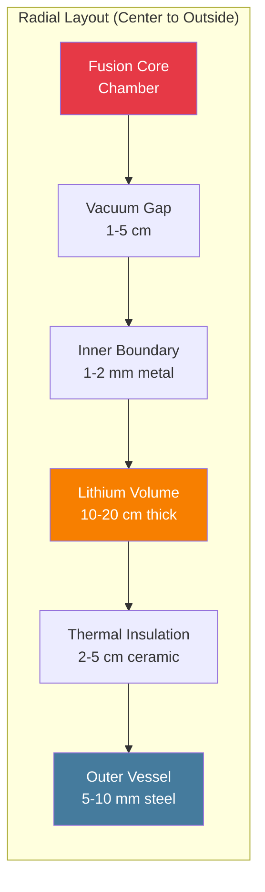

**Dimensions:**
- Inner radius: 20-30 cm
- Outer radius: 30-50 cm
- Lithium volume: 50-200 liters
- Total system diameter: ~1 meter

### 3.2 Lithium Flow Architecture

**Option 1: Static Pool (Natural Convection)**
- No pumping required
- Thermal stratification
- Simpler design
- Lower cost

**Option 2: Forced Circulation (EM Pump)**
- Active flow control
- Uniform temperature
- Enhanced heat extraction
- Higher complexity

**Baseline**: Natural convection with optional EM pump upgrade

### 3.3 Heat Extraction Paths

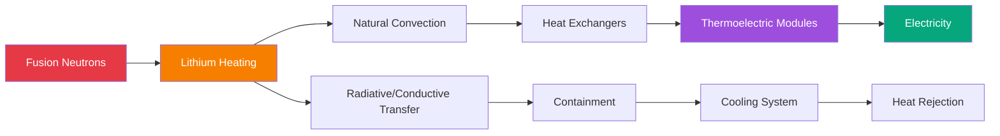

### 3.4 Tritium Management (If Applicable)

For D-T operation or ⁶Li breeding:

- Tritium extraction system (cryogenic or chemical)
- Purification loop
- Storage vessels (requires licensing)
- Monitoring and accountability

**L.A.F.R.E.S. baseline**: Use enriched ⁷Li to minimize tritium production

## 4. Acoustic Field Matrix Architecture

### 4.1 Transducer Array Configuration

**Geometry**: Phased array mounted on outer lithium boundary

```
Top ring: 8-16 transducers (azimuthal symmetry)
Mid-section: 16-32 transducers (multiple layers)
Bottom ring: 8-16 transducers
Total: 32-64 transducers
```

### 4.2 Frequency Strategy

**Multi-band operation:**

| Band | Frequency Range | Purpose |
|------|-----------------|---------|
| Low | 10-50 kHz | Global stabilization, convection control |
| Mid | 50-200 kHz | Surface mode suppression |
| High | 200-500 kHz | Fine-scale damping, diagnostics |

### 4.3 Control Architecture

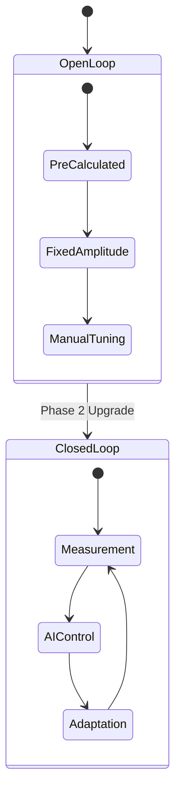

**Phase 1: Open-loop**
- Pre-calculated field patterns
- Fixed amplitude and phase
- Manual tuning

**Phase 2: Closed-loop (AI-driven)**
- Real-time surface measurement (capacitive/optical)
- Adaptive phase and amplitude
- Model-predictive control

### 4.4 Power Distribution

- Total acoustic power: 1-10 kW
- Per-transducer power: 10-200 W
- Efficiency: ~50% (electrical to acoustic)
- Cooling: Water-cooled backing plates

## 5. Thermal Conversion Architecture

### 5.1 Heat Exchanger Design

**Configuration**: Modular heat pipes or direct-contact HX

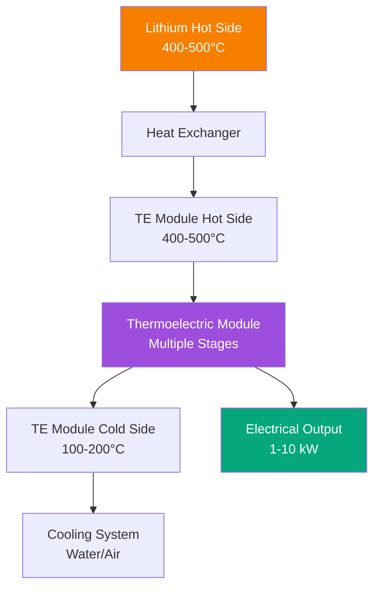

### 5.2 Thermoelectric Module Selection

**Candidate materials:**
- Skutterudites (CoSb₃-based): ZT ~ 1.0 at 500°C
- Half-Heusler alloys: ZT ~ 0.8-1.2 at 500°C
- Segmented designs: Multiple materials optimized per temperature range

**Module configuration:**
- Number of modules: 10-50
- Area per module: 100-500 cm²
- Total power output: 1-10 kW (target)

### 5.3 Alternative: Micro-Stirling Engine

**Pros:**
- Higher efficiency (20-30% potential)
- Mature technology

**Cons:**
- Moving parts (reliability)
- Vibration coupling to lithium
- Higher cost

**Decision**: Thermoelectric preferred for Phase 1

## 6. Sensor Suite Architecture

### 6.1 Sensor Categories

**Thermal Sensors (20-50 points):**
- Thermocouples (Type K, N, or S)
- Locations: Lithium (submersed), containment walls, TE modules, core chamber

**Neutron Detectors (3-10 points):**
- ³He proportional counters (slow neutrons)
- Scintillation detectors (fast neutrons)
- Activation foils (integrated dose)

**Acoustic Sensors (10-30 points):**
- Piezoelectric pressure transducers
- Locations: Multiple points on lithium boundary
- Bandwidth: DC to 1 MHz

**Level/Position Sensors:**
- Capacitive level sensor (lithium surface height)
- Optical interferometry (surface profile)

**Vibration Sensors (5-10 points):**
- Accelerometers on structure
- Detect acoustic coupling, MHD instabilities

**Electrical Sensors:**
- Voltage/current monitors (fusion core, TE modules, acoustic drivers)
- Power meters

**Safety Sensors:**
- Smoke/fire detectors
- Oxygen monitors (detect lithium leak)
- Radiation area monitors
- Hydrogen sensors (tritium, if applicable)

### 6.2 Data Acquisition Architecture

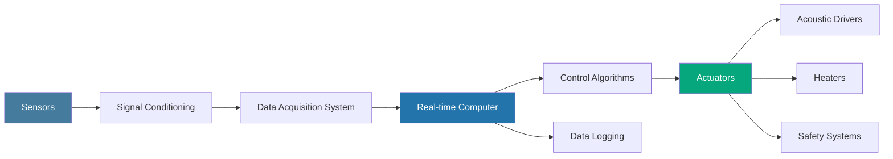

**Sampling rates:**
- Critical safety: 10 kHz
- Acoustic control: 1-10 kHz
- Thermal monitoring: 1-10 Hz
- Neutron counting: 100 Hz - 10 kHz

**Data volume**: ~1-10 MB/s (depends on channel count and sampling)

## 7. AI Control System Architecture

### 7.1 Hardware Platform

**Option 1: FPGA-based**
- Low latency (&lt;1 ms)
- Deterministic timing
- Custom logic for acoustic control

**Option 2: Real-time Linux + GPU**
- Flexible algorithms (neural networks)
- Higher level programming
- Adequate for thermal control

**Baseline**: Hybrid FPGA (acoustic) + GPU (thermal/safety)

### 7.2 Software Architecture

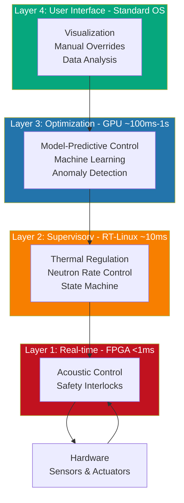

### 7.3 Control Algorithms

**Acoustic Stabilization:**
- Phase-locked loop for surface modes
- Adaptive filtering
- Predictive waveform synthesis

**Thermal Management:**
- PID control (baseline)
- Model-predictive control (advanced)
- Feedforward compensation

**Neutron Rate Control:**
- Pulse frequency modulation
- Gas pressure regulation
- Voltage adjustment

**Safety System:**
- Multi-level voting logic
- Watchdog timers
- Fail-safe defaults

### 7.4 Machine Learning Integration

**Potential applications:**
- **Anomaly detection**: Unsupervised learning on sensor data
- **Predictive maintenance**: Time-series forecasting of component health
- **Control optimization**: Reinforcement learning for multi-objective optimization
- **Physics emulation**: Neural network surrogates for fast simulation

**Training data**: Simulated data + experimental data from Phase 1 testing

## 8. Safety System Architecture

### 8.1 Safety-Rated Interlocks

**Level 1: Hardware (non-software)**
- Overpressure relief valves
- Thermal fuses
- Mechanical shutters

**Level 2: Dedicated safety PLC**
- Independent from main control system
- Redundant sensors
- 2-out-of-3 voting logic

**Level 3: Software safety monitors**
- Running on main control system
- Continuous self-checks
- Alarm escalation

### 8.2 Emergency Shutdown Sequence

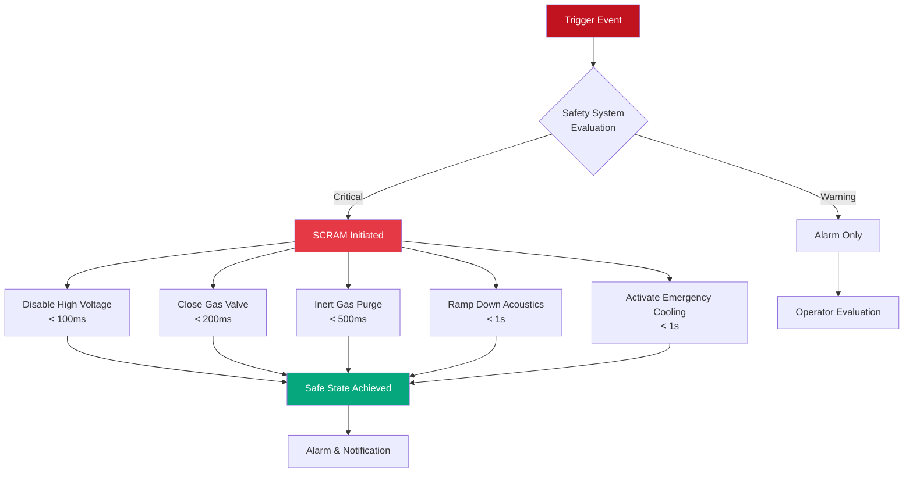

**Triggered by:**
- Lithium temperature &gt;550°C
- Vacuum loss in core chamber
- Coolant flow failure
- Neutron rate &gt;110% setpoint
- Manual SCRAM button

**Actions (automatic, &lt;1 second):**
1. Disable fusion core high voltage
2. Close deuterium gas valve
3. Activate inert gas (argon) purge
4. Ramp down acoustic power
5. Activate emergency cooling
6. Sound alarms

### 8.3 Redundancy and Fail-Safe Design

- **Dual power supplies** (mains + battery backup for safety systems)
- **Redundant sensors** (critical parameters measured by 2-3 independent sensors)
- **Fail-safe valves** (close on power loss)
- **Passive cooling** (natural circulation backup)

## 9. Operational Modes

### 9.1 Startup Sequence

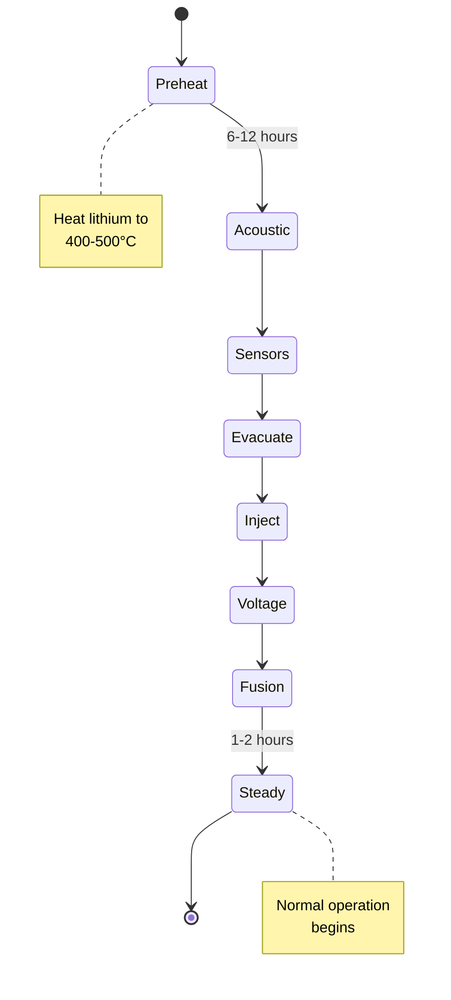

1. **Preheat lithium** (electric heaters, 6-12 hours)
2. **Activate acoustic system** (low power, check resonances)
3. **Verify sensors** (calibration, diagnostics)
4. **Evacuate core chamber** (&lt;10⁻⁴ Torr)
5. **Inject deuterium** (pressure setpoint)
6. **Apply core voltage** (ramp gradually)
7. **Initiate neutron production** (confirm with detectors)
8. **Establish thermal steady-state** (may take 1-2 hours)

### 9.2 Normal Operation

- Continuous monitoring of all parameters
- Automatic adjustments by AI control
- Periodic logging and archival
- Operator supervision (minimal intervention)

### 9.3 Shutdown Sequence

1. **Reduce fusion power** (lower voltage or pulse rate)
2. **Pump out deuterium** (return to vacuum)
3. **Cool lithium** (passive or active cooling)
4. **Secure acoustic system** (power down)
5. **Lock out high voltage** (maintenance mode)

### 9.4 Maintenance Mode

- Lithium solidified (&lt;180°C) or drained
- All power systems de-energized and locked out
- Access to internal components (requires radiation survey)

## 10. Scalability and Modularity

### 10.1 Modular Design Principles

- **Replaceable core**: Fusion chamber can be upgraded without rebuilding entire system
- **Modular acoustics**: Individual transducers can be replaced
- **Stackable TE modules**: Easy to add/remove for optimization

### 10.2 Scaling Path

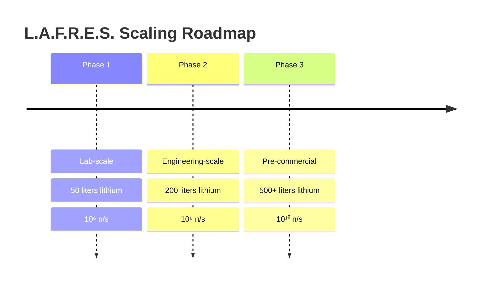

Key challenges in scaling:
- Maintaining acoustic field uniformity
- Heat extraction at higher power densities
- Structural integrity (larger pressure vessels)

---

**Document Version**: 1.0  
**Last Updated**: December 2025  
**Author**: L.A.F.R.E.S. Systems Engineering Team

